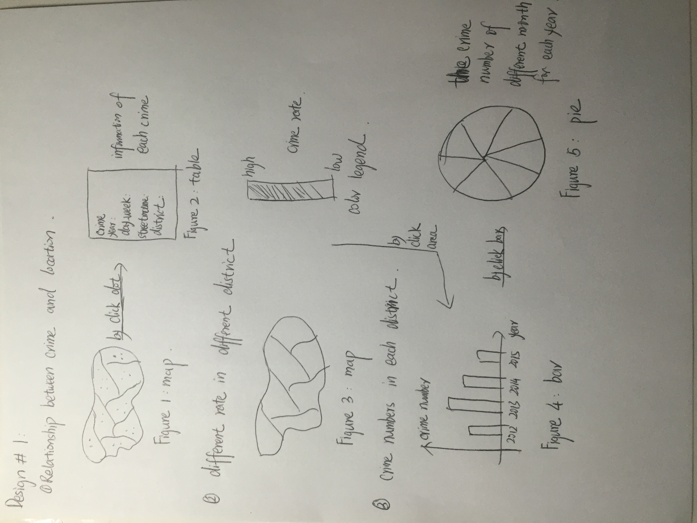
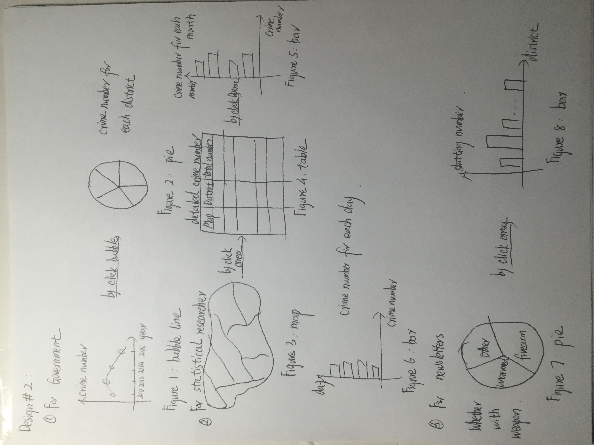
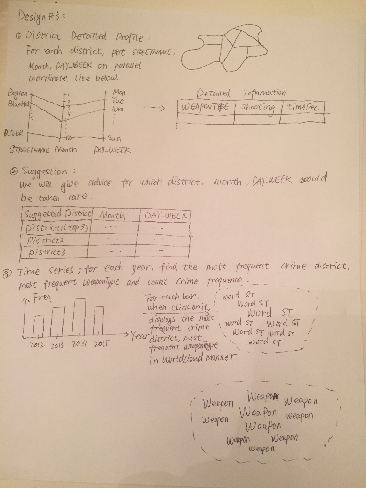
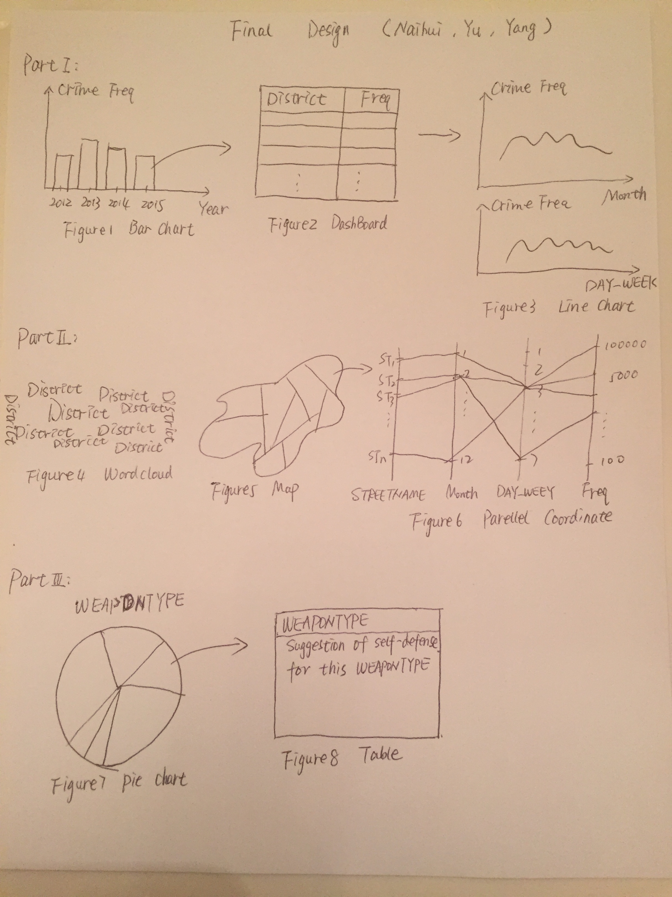

Final Project - Crime incidents report in Boston neighborhood. 
===
Basic Info
---
Team members: 

Yu Tian, ytian2@wpi.edu, Github ID: ytian2

Yang Liu, yliu15@wpi.edu, Github ID: erouirior

Naihui Wang, nwang@wpi.edu, Github ID: Naihui

Link to Project Repository: https://github.com/ytian2/DataVisualization-for-Crime-Incidents/tree/master

Background and Motivation
---
As everyone know, there is a tragedy in Paris caused by ISIS on Nov, 15th, 2015, and one day after that, weapons were stolen from Worcester armory. At the same day, Harvard University even received bomb threat. Just a few days before, all cars were smashed in a parking lot on a street on which many of our WPI students live. Crime incidents are just around us, in our daily lives. The world is never in peace, even in Boston neighborhood, crime incidents are everywhere, affects our daily life and safety.

Under this circumstance, we decide to do this project about crime incident in Boston neighborhood. From this project, we are trying to let people know how many crimes are there in our daily lives? What kind of crime it is? When and where will crime happen mostly? We want to let everyone be cautious and know he or she should always be prepared for the crime.  Even if there is only one person can be more alert about crime from our visualizations, we can say we did a good job, this visualization is useful.

Project Objectives
---
a.	What’s the trend of total crime incidents happened in Boston neighborhood from 2012 to 2015?

b.	Which district in Boston neighborhood is the most safe and unsafe?

c.	What’s the weight for different type of crime? Was it with firearm, unarmed or other? If it was with firearm, did shooting happen?

d.	What’s the detailed number of crime incidents happened in different district, year and month?

e.	Which year, month did crime happen most?

From this project, we want to show the data deeper and deeper. We will visualize the data focused on three different parts. First, we will focuse on time trend to show the crime frequency.Second, we will focuse on location related crime frequency. Last, we will focuse on weapon types used in crime incidents. 

From the website, we will give people several different variables of data that they may care about.

Data 
---
Data: Crime_Incident_Reports.csv, 46.3MB, 253019 records, 11 variables.

Variables: 

a.	ID(int): the record number, it is unique for each record.

b.	WEAPONTYPE(string): use Firearm, Knife, or Personal Weapon, e.g., foot, hand, etc.

c.	Shooting(Boolean): Boolean variable, shoot or not.

d.	Year(int): from 2012 to 2015, indicates which year the crime happened.

e.	Month(int): from January to December using number 1 to 12.

f.	DAY_WEEK(string): Monday, Tuesday, Wednesday, Thursday, Friday, Saturday, Sunday. 

g.	STREETNAME(string): streetname where the crime happened.

h.	timeDec(string): four time intervals for one day, i.e., (0,6], (6,12], (12,18], (18, 24].

i.	ReptDistrName(string): the district name where the crime happened.

j.	lng(float): longitude of the location where the crime happened. 

k.	lat(float): latitude of the location where the crime happened.

Data Processing
---
a.	Drop irrelevant variables (not useful for analysis): COMPNOS (Complaint number), NatureCode, X, Y, REPORTINGAREA, DOMESTIC.

b.	For Location, expand it to lat and lng variables and delete the Location variable.

c.	Converting the Year and Month variables from numeric to factor.

d.	Replacing the date time with R-formatted date string, i.e., replace "mm/dd/yy xx:xx" to "yyyy-mm-dd xx:xx:xx".

e.	Deriving the time of the day the crime took place from variable FROMDATE.

f.	Deriving whether the crime took place during the day or at night (7:00pm-7:00am).

g.	Cutting a day into four chunks of interval with 6 hours each.

h.	Reveal the order of DAY_WEEK, following 'Sunday', 'Monday',..., 'Saturday' sequence.

i.	Delete the data whose lat=0, lng=0, because it will influence the geography visualization; deleting rows whose lat and lng value are NA.

j.	Adjust the letter case confusion.

k.	Converting the REPTDISTRICT into readable Boston district names: i.e., A1='Downtown', A15='Charlestown', etc. And replace REPTDISTRICT to ReptDistrName; deleting rows whose RepDistrName value is NA.

l.	Deriving table form STREETNAME to form street dataset, delete the data whose street.Name is blank.

Visualization Design
---
(1) Frist prototype:

The first prototype is showed as below. This prototype is based on three questions. 

The first one is the relation between crime and location, we want to design a map (figure 1), the crimes are marked as dots on map, by clicking the dot on map, there will be a table (figure 2) on the right shows the detailed information of each crime.

The second question is to show the different crime rate in different districts. There will be a map showed the districts (figure 3) with gradient color, a color legend is on the right.

The third question is to show the crime numbers in each district. By clicking the map (figure 3), a vertical bar chart (figure 4) will show up to show crime numbers in different years. And by clicking the bar, a pie chart (figure 5) will show up to show the crime numbers of different month for each year.

The whole design is showed as below.

(2) Second prototype:

The second prototype is showed as below. This prototype is based on three parts, each part focused on different information about crime. We set the part by different groups of people. 

The first one is for government, we want to do a bubble line chart (figure 1) to show the total crime numbers in different year, and by clicking the bubble, a pie chart (figure 2) will show up to show the crime number for each district of each year.

The second one is for statistical researcher, we do a district map (figure 3), by clicking the district, a table (figure 4) contains the name of district and total crime numbers of district will show. By clicking the district name, a horizontal bar chart (figure 5) shows the total crime numbers for each month and another horizontal bar chart (figure 6) shows the total crime numbers for each day will show up simultaneously. 

The third one to for newsletters, a pie chart (figure 7) will show up with the information of whether the crime is with weapon or not. By clicking the firearm area, a vertical bar chart will show up to show the detailed shooting number when with firearm for each district.

The whole design is showed as below.

(3) Third prototype:

The third prototype is showed as below. This prototype involves 5 visualizations: map, parallel coordinate, dashboard, bar chart, and word cloud. It has three parts:

The first part is "District Detailed Profile": for each district, draw STREETNAME, Month, DAY_WEEK on parallel coordinate. When click on one line in parallel coordinate, the related dashboard will display on left side, which contains WEAPONTYPE, Shooting, timeDec. From this part, we want to show which month and day relate closely with one specific street. And for specific street, what's the weapontype, whether shoot, when to happen.

The second part is the suggestion based on the first part. A dashboard contains three columns: ReptDistrName, Month, DAY_WEEK.  The first column consists of the top3 safest district; and for each district, which months are the safest, which DAY_WEEK are the safest.

The third part is the crime trend. This trend visualized by bar chart. For interactively displaying, we design that by clicking each bar,  two wordcloud graphs will appear on left side. These wordcloud graphs are based on the STREETNAME frequency and WEAPONTYPE respectively.

The whole design is showed as below.

(4) Final prototype

Based on the three designs above, we redesigned a new one. This one is focused on three parts. And the details of the website are not showed in this prototype.

The first part is focused on time trend of crime numbers. 

We will design a bar chart (figure 1) shows the crime frequency from 2012 to 2015 in Boston neighborhood. It may link to a table (figure 2) shows the crime frequency of different district each year. Then the table will link to two line charts (figure 3), one shows the crime frequency for every month in different district. Another shows the crime frequency for every day of week in different district.

The second part involves three visualizations: word cloud, map, parallel coordinate.

On left side, we draw a word cloud (figure 4) of ReptDistrName to know which districts are most not safest, then we will design a district map (figure 5) to further exploration in detail in parallel coordinate (figure 6) using STREETNAME, Month, DAY_WEEK, and related Frequency. By drawing parallel coordinate, we can easily get the story that in specific district, the frequency of specific streets in specific month on specific day of week. Then people can easily cluster those streets by month and day of week.

The third part is focused on weapon type used in every crime incident. 

We will design a pie chart (figure 7) shows the frequency of different weapons used in all crime incidents. This pie chart will link to a table (figure 8) give some tips for self – protection when faced with different weapons in crime.

Must-Have Features
---
(1)	For the first part, it’s focused on time trend.

a.	We must have bar chart to show the crime frequency from 2012 to 2015. 

b.	We must have line chart linked to the table to show crime frequency in each district based on month and day.

(2)	For the second part, it’s focused on location.

a.	We must have a district map of Boston neighborhood.

(3)	For the third part, it’s focused on attack way.

a.	We must have a pie chart to show frequency of different attack ways in all crime incidents. 

b.	The pie chart should link to a table in which we give some specific tips for protecting ourselves when faced different attack ways.

Optional Features
---
(1)	For the first part

a.	We could have table interactive to bar chart to show crime frequency of different district in each year.

(2)	For the second part

a.	We could have a word cloud to show the crime frequency of different district.

b.	We could have a parallel coordinate linked to the district map to show the crime number based on street name, month, day of week and frequency.

Project Schedule
---
November 18 : Finish project proposal.

November 19 -- November 26: Do data process and clean, finish the framework of website, including the basic view prototype, write process book simultaneously.

November 27 – December 3: Create interaction between views, finish the must – have features, prepare for prototype presentation, write process book simultaneously.

December 4 – December 8: Finish the optional features, continue doing interaction between views and finish the website. Write process book draft.

December 9 – December 15: Finish and modify the whole website, proof the process book, finish the screen – cast of this website. 

References
---
Dataset Source: https://data.cityofboston.gov/Public-Safety/Crime-Incident-Reports/7cdf-6fgx

Design Inspired By: http://www.city-data.com
