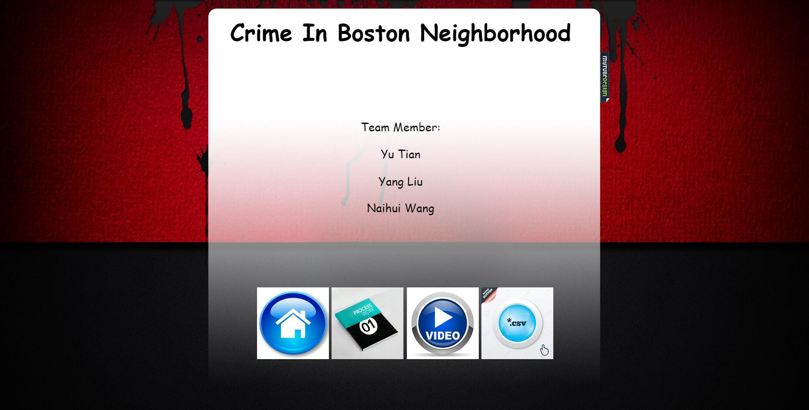
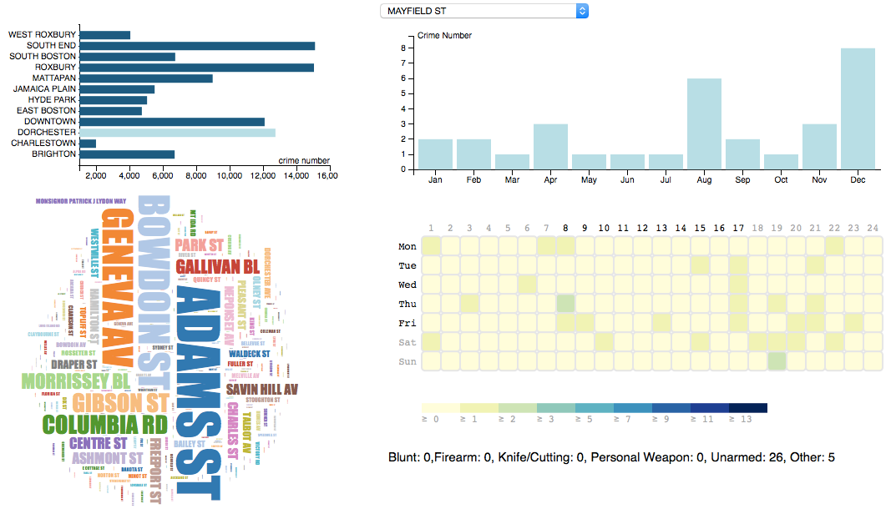
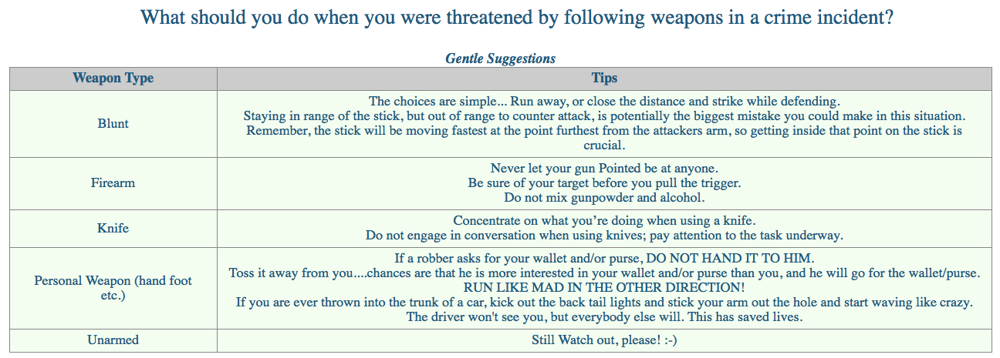
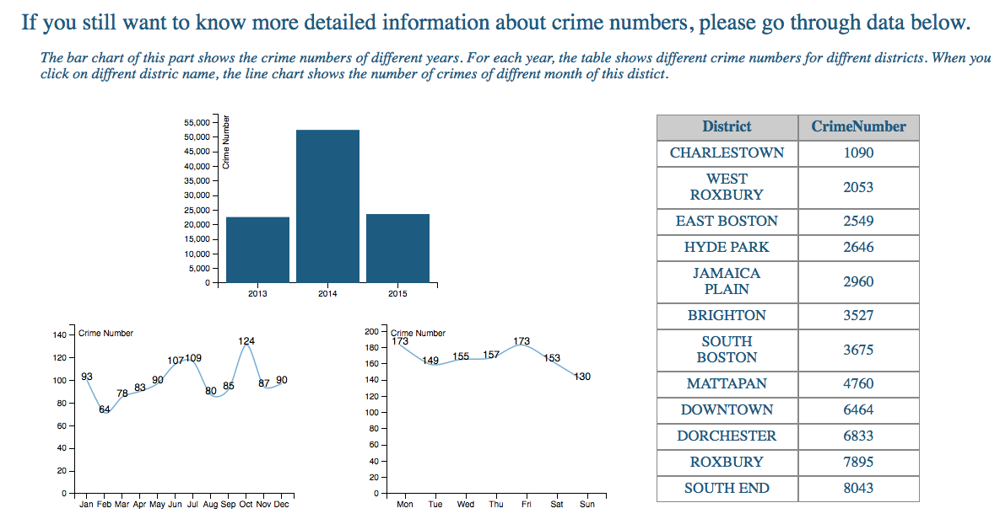

#Final Project - Interactive Data Visualization  
---
#Project Team (Name and GitHub ID):
---
- Yu Tian, ytian2
- Yang Liu, erouirior
- Naihui Wang, Naihui

Link to Project Repository: https://github.com/ytian2/DataVisualization-for-Crime-Incidents/tree/master

#Links:
---
- Our Demo link:[Crime Visualization Demo Link](http://ytian2.github.io/DataVisFinal/firstPage.html) 
- Our Screencast link:[Screencast Link](https://www.youtube.com/watch?v=JuHWyqIqRuc) 

#Overview and Objective:
---
As everyone know, there is a tragedy in Paris caused by ISIS on Nov, 15th, 2015, and one day after that, weapons were stolen from Worcester armory. At the same day, Harvard University even received bomb threat. Just a few days before, all cars were smashed in a parking lot on a street on which many of our WPI students live. 

Under this circumstance, we decide to do this project about crime incident in Boston neighborhood. From this project, we are trying to let police know how many crimes are there in our daily lives? What kind of crime it is? When and where will crime happen mostly? We want to give useful information for Boston polices to have a rough understanding of crimes.

#Introduction Page:
---
There is 4 buttons on first. First one licks to the visualization. Second one links to the processbook. The third one links to the demo video. And the last one lins to the data.
 Our demo introduction starts here! 

#Data:
---
Our raw data is collected from this source: https://data.cityofboston.gov/Public-Safety/Crime-Incident-Reports/7cdf-6fgx

And finally our data sets contain 3 parts:
- Crime_Incident_Reports.csv, 12.3MB, 98,791 records, 11 variables.
- heatmap.csv, 37.7MB, 790,609 records, 5 variables.
- word_cloud.csv, 106KB, 4328 records, 3 variables.

#Layout Part 1:
---
The first part is focused on streets' information. 
 We write part1.js to show the first part interactive visualization. It contains the initial horizontal bar chart on each district through year 2013 to 2015. Once you click one district, it will call d3.layout.cloud.js to show wordcloud figure.
 It also controls the call to the month crime frequency vertival bar chart and the day-hour calendar heatmap.
   
Summary:
 Polices can know the detailed information from comprehensive aspects from district, street, month, day and even hour. For example, in Jamaica Plain district, the Columbus Av is the most dangerous street; and in Columbus Av, the most dangerous month is December, and on Friday, the most dangerous hour is 22:00. In this street, it happened with 6 firearm crimes , 6 knife/cutting crimes. So polices can have a rough sense of Columbus Av street in Jamaica Plain.

#Layout Part 2:
---
The second part is focused on suggestion.
 This part is shown as a table in index.html.
   
We think it is necessary to let people and also help police how to give suggestion on each weapon type.

#Layout Part 3:
---
This part will provide more detailed information of crimes data. 
 We write part2.js to complete this part. At first, a histogram of crimes from year 2013 to 2015 appears first, then once you click one of them, a table of districts with crime number in ascending order will appear on right hand side.
 once you click each district name in the table, the district name's color will change to red; at the same time, two line charts will appear under histogram graph after clicking the district name in that table. 
  
 Police can get the sense on each district of what time is with high crime frequency. 
 And they can also know general trend of crimes in Boston and neighborhoods. In our analysis, police can easily and directly know there are much more crimes happened in 2014 than 2013 and 2015. And in 2013, Charlestown district is the most safe area, plus, most crimes happened in the last 5 months.

#References:
---
- Dataset Source: https://data.cityofboston.gov/Public-Safety/Crime-Incident-Reports/7cdf-6fgx
- Design Inspired By: 
 http://www.city-data.com
 http://www.crimeinchicago.org/
 http://www.dataplusscience.com/insights.html
 http://opendatabits.com/visualizing-the-relationships-between-chicago-homicides-and-hot-weather/
 http://public.tableau.com/profile/jeffs8297-!/vizhome/ACincinnatiCrimeVisualization/StartPage
 https://www.wprdc.org/showcase/city-of-pittsburgh-crime-visualizations/

